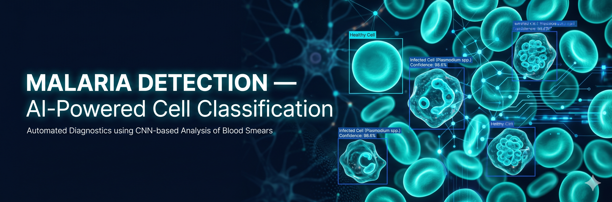

# Malaria Detection — AI-Powered Cell Classification



[](https://www.python.org/)
[](https://pytorch.org/)
[](https://www.gradio.app/)
[](LICENSE)

Malaria kills hundreds of thousands of people every year, and diagnosis still
relies on a lab technician manually examining blood smears under a microscope.
This project fine-tunes a ResNet-18 image classifier to automatically tell
**parasitized** cells from **uninfected** ones — a step toward faster,
cheaper, more consistent malaria screening.

## Live demo

Try it on Hugging Face Spaces: **[malaria-detection demo](https://huggingface.co/spaces/mauryasameer/malaria-detection)**

Upload a microscope image of a single blood cell and get an instant
classification with a confidence score.

## How it works

```
NIH Malaria Cell Images dataset → ResNet-18 (transfer learning) → parasitized / uninfected
```

The model starts from ImageNet-pretrained weights and is fine-tuned on the
[NIH Malaria Cell Images dataset](https://lhncbc.nlm.nih.gov/LHC-research/LHC-projects/image-processing/malaria-datasheet.html)
(~27,000 labeled cell images, two classes).

## Results

| Metric | Value |
|---|---|
| Validation accuracy | see `outputs/metrics.json` after training |
| Precision / Recall / F1 | see `outputs/metrics.json` after training |

Run the training notebook (below) to reproduce these numbers from scratch.

## Quickstart

```bash
git clone https://github.com/mauryasameer/Malaria_detection.git
cd Malaria_detection
pip install -r requirements.txt
```

**Run inference on a single image:**

```bash
python -m malaria_detection.infer outputs/model.pt path/to/cell.png
```

**Run the Gradio demo locally:**

```bash
python app.py
```

**Train from scratch:**

The full NIH dataset is too large to ship in the repo. Use the included Colab
notebook to train on a free GPU:

[`notebooks/train_colab.ipynb`](notebooks/train_colab.ipynb) — open in Colab,
run all cells, download the resulting `model.pt` + `metrics.json`.

Or train locally once you have the dataset extracted to `data/cell_images/`:

```bash
python -m malaria_detection.train --data-dir data/cell_images --output-dir outputs --epochs 10
```

## Project structure

```
malaria_detection/   # dataset, model, training, inference
notebooks/           # Colab GPU training notebook
app.py               # Gradio demo (deployed to HF Spaces)
tests/               # pytest suite (synthetic data, no dataset download needed)
```

## Tech stack

Python · PyTorch · torchvision · Gradio · pytest

## License

[MIT](LICENSE)
